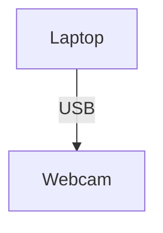
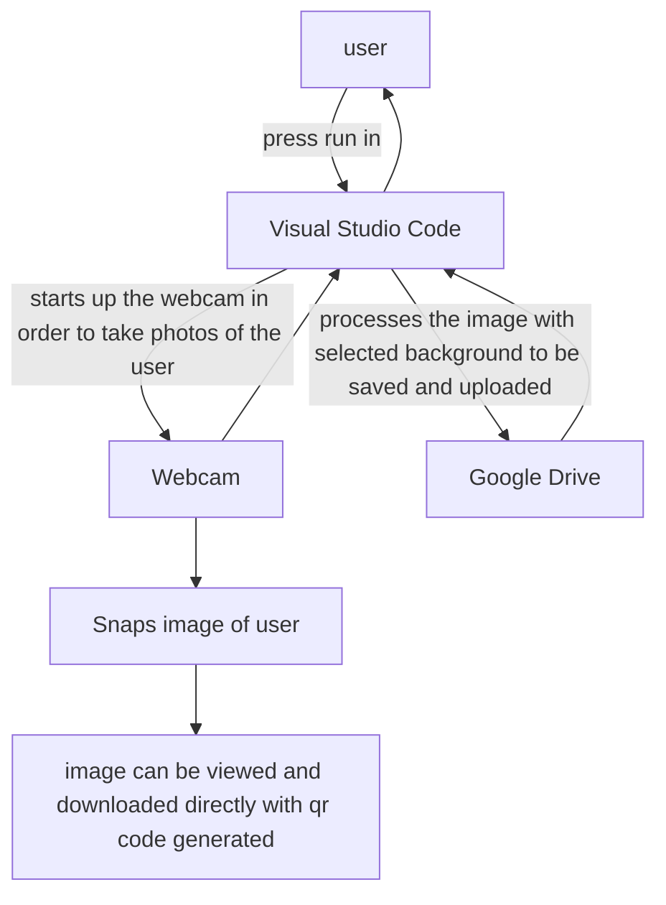

# Introduction
# About the project itself
- To allow users to capture images of themselves or with friends and family using the Python script program which acts like a customizable photo booth
- Without having to set up an actual green screen physically, users are able to pick from a range of background images to use as their background for the final image output
- The program will then proceed to process the image taken by the user so that it removes the background behind them, and replaces it with the background that they have picked in the previous step
- Users will not only be able to see their final image, but they are also able to download the image by scanning a qr code
- Even if the qr code is lost, the image can still be accessed within the "shared with me" folder in Google Drive, where the folder named "picture booth" contains the images that they have taken

## Dependencies
### Hardware
- A laptop to run the Python script program
- The laptop's webcam or a usb webcam to snap images of the user

### Software
- Google Cloud Server API (to allow images to be uploaded from the Python script into the Google Drive)
- Google Drive
- Visual Studio Code
- Python libraries
- https://pypi.org/project/opencv-python/ (for processing as well as analyzing images taken)
- https://pypi.org/project/qrcode/ (to generate the qr code for users to scan and download the image directly)

## System diagram


## Code logic
## How the code starts up the webcam in order to take images of the user and customize their photos

##Code used
```
import tkinter as tk
from tkinter import messagebox
from PIL import Image, ImageTk, ImageDraw
from pydrive.drive import GoogleDrive
from pydrive.auth import GoogleAuth
import threading
import os
import datetime
import cv2
import numpy as np
import time
import json
import qrcode

os.environ["OPENCV_VIDEOIO_MSMF_ENABLE_HW_TRANSFORMS"] = "0"

try:
    from rembg import remove
    REMBG_AVAILABLE = True
except ImportError:
    print("Warning: rembg not available. Will use improved OpenCV background removal instead.")
    REMBG_AVAILABLE = False

TIMESTAMP = datetime.datetime.now().strftime("%Y%m%d_%H%M%S")
PERSONAL_GMAIL = "ranielle0@gmail.com"

BACKGROUND_IMAGES = {
    "P1": r"C:\Users\chu2\Downloads\wp9550740-genshin-impact-inazuma-wallpapers.jpg",
    "P2": r"C:\Users\chu2\Downloads\950x350-teal-deer-solid-color-background.jpg",
    "P3": r"C:\Users\chu2\Downloads\1920x1080-bright-green-solid-color-background.jpg",
}

BACKGROUND_LABELS = {
    "P1": "sky",
    "P2": "grass",
    "P3": "green",
}

def share_file_with_gmail(drive, file_id, email_address):
    """Share a file with a specific Gmail address"""
    try:
        permission = {
            'type': 'user',
            'role': 'reader',  # Can be 'reader', 'writer', or 'owner'
            'emailAddress': email_address
        }
        drive.auth.service.permissions().create(
            fileId=file_id,
            body=permission,
            sendNotificationEmail=True  # This will send an email notification
        ).execute()
        print(f"File shared with {email_address}")
        return True
    except Exception as e:
        print(f"Error sharing file with {email_address}: {e}")
        return False

class WebcamApp:
    def __init__(self):
        self.root = tk.Tk()
        self.root.title("WELCOME TO MTS")
        self.root.attributes('-fullscreen', True)
        self.root.configure(bg='white')

        self.cap = cv2.VideoCapture(0, cv2.CAP_MSMF)
        self.cap.set(cv2.CAP_PROP_FRAME_WIDTH, 1920)
        self.cap.set(cv2.CAP_PROP_FRAME_HEIGHT, 1080)

        self.captures_dir = "captures"
        if not os.path.exists(self.captures_dir):
            os.makedirs(self.captures_dir)
            print(f"Created directory: {self.captures_dir}")

        self.background_reference_path = os.path.join(self.captures_dir, "background_reference.png")
        self.background_reference = None
        self.load_or_capture_background_reference()

        self.countdown = 5
        self.countdown_start_time = None
        self.selected_background = None
        self.dot_count = 0
        self.current_window = None
        self.captured_frame = None
        self.captured_image_path = None

        self.create_main_interface()

        self.root.bind('<Escape>', self.on_escape)

    def on_escape(self, event):
        self.root.quit()

    def load_or_capture_background_reference(self):
        if os.path.exists(self.background_reference_path):
            try:
                self.background_reference = cv2.imread(self.background_reference_path)
                if self.background_reference is not None:
                    print(f"Background reference loaded from: {self.background_reference_path}")
                    print(f"Background reference shape: {self.background_reference.shape}")
                    return
                else:
                    print("Failed to load existing background reference, capturing new one...")
            except Exception as e:
                print(f"Error loading background reference: {e}")
                print("Capturing new background reference...")
        else:
            print("No existing background reference found, capturing new one...")
        self.capture_background_reference()

    def capture_background_reference(self):
        print("Capturing background reference in 3 seconds...")
        print("Please ensure the area is empty of people...")
        time.sleep(3)
        ret, frame = self.cap.read()
        if ret:
            self.background_reference = cv2.GaussianBlur(frame, (5, 5), 0)
            try:
                cv2.imwrite(self.background_reference_path, self.background_reference)
                print(f"Background reference captured and saved to: {self.background_reference_path}")
                print(f"Background reference shape: {self.background_reference.shape}")
                backup_path = os.path.join(self.captures_dir, f"background_reference_backup_{TIMESTAMP}.png")
                cv2.imwrite(backup_path, self.background_reference)
                print(f"Backup saved to: {backup_path}")
            except Exception as e:
                print(f"Error saving background reference: {e}")
        else:
            print("Failed to capture background reference")

    def recapture_background_reference(self):
        print("Recapturing background reference...")
        self.capture_background_reference()
        messagebox.showinfo("Background Reference",
                            f"New background reference captured and saved!\nSaved to: {self.background_reference_path}")

    def create_main_interface(self):
        for widget in self.root.winfo_children():
            widget.destroy()

        main_frame = tk.Frame(self.root, bg='white')
        main_frame.pack(fill=tk.BOTH, expand=True)

        welcome_label = tk.Label(
            main_frame,
            text="WELCOME TO MTS",
            font=("Arial", 48, "bold"),
            fg="#333",
            bg='white'
        )
        welcome_label.pack(expand=True)

        button_frame = tk.Frame(main_frame, bg='white')
        button_frame.pack(pady=20)

        capture_btn = tk.Button(
            button_frame,
            text="Click here for Photo",
            font=("Arial", 48, "bold"),
            fg="#333",
            bg="#f0f0f0",
            activebackground="#e0e0e0",
            relief=tk.RAISED,
            bd=3,
            padx=20,
            pady=20,
            command=self.start_countdown
        )
        capture_btn.pack(pady=20)

        recapture_btn = tk.Button(
            button_frame,
            text="Recapture Background",
            font=("Arial", 24, "bold"),
            fg="#666",
            bg="#f8f8f8",
            activebackground="#e8e8e8",
            relief=tk.RAISED,
            bd=2,
            padx=15,
            pady=10,
            command=self.recapture_background_reference
        )
        recapture_btn.pack(pady=10)

        if self.background_reference is not None:
            status_text = f"Background reference loaded ✓\nSaved at: {self.background_reference_path}"
            status_color = "#228B22"
        else:
            status_text = "No background reference ✗"
            status_color = "#DC143C"

        status_label = tk.Label(
            main_frame,
            text=status_text,
            font=("Arial", 14),
            fg=status_color,
            bg='white'
        )
        status_label.pack(pady=10)

        self.current_window = "main"

    def start_countdown(self):
        self.countdown = 5
        self.countdown_start_time = time.time()
        self.captured_frame = None
        self.captured_image_path = None
        self.create_preview_window()
        self.update_preview()

    def create_preview_window(self):
        for widget in self.root.winfo_children():
            widget.destroy()

        preview_frame = tk.Frame(self.root, bg='black')
        preview_frame.pack(fill=tk.BOTH, expand=True)

        self.preview_image_label = tk.Label(preview_frame, bg='black')
        self.preview_image_label.pack(expand=True, fill=tk.BOTH)

        self.button_frame = tk.Frame(preview_frame, bg='black', height=120)
        self.button_frame.pack(side=tk.BOTTOM, fill=tk.X)
        self.button_frame.pack_propagate(False)

        restart_btn = tk.Button(
            self.button_frame,
            text="Restart",
            font=("Arial", 48, "bold"),
            fg="#333",
            bg="#f0f0f0",
            activebackground="#e0e0e0",
            relief=tk.RAISED,
            bd=3,
            padx=20,
            pady=20,
            command=self.restart_capture
        )
        restart_btn.pack(side=tk.LEFT, padx=20, pady=10)

        ok_btn = tk.Button(
            self.button_frame,
            text="OK",
            font=("Arial", 48, "bold"),
            fg="#333",
            bg="#f0f0f0",
            activebackground="#e0e0e0",
            relief=tk.RAISED,
            bd=3,
            padx=20,
            pady=20,
            command=self.close_fullscreen_photo
        )
        ok_btn.pack(side=tk.RIGHT, padx=20, pady=10)

        self.button_frame.pack_forget()
        self.current_window = "preview"

    def update_preview(self):
        if self.current_window != "preview":
            return

        ret, frame = self.cap.read()
        if not ret:
            self.root.after(30, self.update_preview)
            return

        frame_copy = frame.copy()

        if self.countdown_start_time is not None:
            elapsed = time.time() - self.countdown_start_time
            remaining = max(0, 5 - elapsed)
            current_countdown = int(remaining) + 1 if remaining > 0 else 0

            if current_countdown > 0:
                cv2.putText(
                    frame_copy, f"{current_countdown}", (30, 60),
                    cv2.FONT_HERSHEY_SIMPLEX, 2, (0, 0, 255), 4
                )

            if elapsed >= 5.0 and self.captured_frame is None:
                self.captured_frame = frame.copy()
                self.captured_image_path = os.path.join(self.captures_dir, f"captured_{TIMESTAMP}.png")

                cv2.imwrite('temporary.png', self.captured_frame)
                cv2.imwrite(self.captured_image_path, self.captured_frame)

                print(f"Image captured after exactly 5 seconds with resolution: {self.captured_frame.shape[1]}x{self.captured_frame.shape[0]}")
                print(f"Permanent image saved as: {self.captured_image_path}")

                self.button_frame.pack(side=tk.BOTTOM, fill=tk.X)
                self.root.title("Captured Photo - Choose an option")

        rgb_image = cv2.cvtColor(frame_copy, cv2.COLOR_BGR2RGB)
        pil_image = Image.fromarray(rgb_image)

        screen_width = self.root.winfo_screenwidth()
        screen_height = self.root.winfo_screenheight() - 140

        img_width, img_height = pil_image.size
        aspect_ratio = img_width / img_height

        if aspect_ratio > screen_width / screen_height:
            new_width = screen_width
            new_height = int(screen_width / aspect_ratio)
        else:
            new_height = screen_height
            new_width = int(screen_height * aspect_ratio)

        pil_image = pil_image.resize((new_width, new_height), Image.Resampling.LANCZOS)
        photo = ImageTk.PhotoImage(pil_image)

        self.preview_image_label.configure(image=photo)
        self.preview_image_label.image = photo

        if self.captured_frame is None:
            self.root.after(30, self.update_preview)

    def restart_capture(self):
        self.start_countdown()

    def close_fullscreen_photo(self):
        self.show_background_selection()

    def show_background_selection(self):
        for widget in self.root.winfo_children():
            widget.destroy()

        self.root.title("Choose Background")

        bg_frame = tk.Frame(self.root, bg='white')
        bg_frame.pack(fill=tk.BOTH, expand=True, padx=20, pady=20)

        title_label = tk.Label(
            bg_frame,
            text="Choose Background",
            font=("Arial", 48, "bold"),
            fg="#333",
            bg='white'
        )
        title_label.pack(pady=20)

        preview_frame = tk.Frame(bg_frame, bg='#f9f9f9', relief=tk.RAISED, bd=2)
        preview_frame.pack(fill=tk.BOTH, expand=True, pady=20)

        self.background_preview = tk.Label(
            preview_frame,
            text="Click a background to preview",
            font=("Arial", 24),
            fg="#666",
            bg='#f9f9f9'
        )
        self.background_preview.pack(expand=True, fill=tk.BOTH)

        button_frame = tk.Frame(bg_frame, bg='white')
        button_frame.pack(fill=tk.X, pady=20)

        for bg_key, bg_path in BACKGROUND_IMAGES.items():
            button_text = BACKGROUND_LABELS.get(bg_key, bg_key)

            btn = tk.Button(
                button_frame,
                text=button_text,
                font=("Arial", 36, "bold"),
                fg="#333",
                bg="#f0f0f0",
                activebackground="#e0e0e0",
                relief=tk.RAISED,
                bd=3,
                padx=15,
                pady=15,
                command=lambda key=bg_key: self.select_background(key)
            )
            btn.pack(side=tk.LEFT, padx=10, expand=True, fill=tk.X)

        ok_btn = tk.Button(
            bg_frame,
            text="OK",
            font=("Arial", 48, "bold"),
            fg="#333",
            bg="#f0f0f0",
            activebackground="#e0e0e0",
            relief=tk.RAISED,
            bd=3,
            padx=20,
            pady=20,
            command=self.finish_background_selection
        )
        ok_btn.pack(pady=20)

        self.current_window = "background"
        self.selected_background = None

    def select_background(self, background_key):
        self.selected_background = background_key
        selected_data = {
            "selected_image_path": BACKGROUND_IMAGES.get(background_key)
        }
        with open("selected_bg.json", "w") as f:
            json.dump(selected_data, f)

        background_path = BACKGROUND_IMAGES.get(background_key)
        if background_path and os.path.exists(background_path):
            try:
                bg_image = Image.open(background_path)
                self.root.update_idletasks()
                preview_width = self.background_preview.winfo_width()
                preview_height = self.background_preview.winfo_height()
                if preview_width > 1 and preview_height > 1:
                    img_width, img_height = bg_image.size
                    aspect_ratio = img_width / img_height
                    if aspect_ratio > preview_width / preview_height:
                        new_width = preview_width
                        new_height = int(preview_width / aspect_ratio)
                    else:
                        new_height = preview_height
                        new_width = int(preview_height * aspect_ratio)
                    bg_image = bg_image.resize((new_width, new_height), Image.Resampling.LANCZOS)
                    photo = ImageTk.PhotoImage(bg_image)
                    self.background_preview.configure(image=photo, text="")
                    self.background_preview.image = photo
                else:
                    button_text = BACKGROUND_LABELS.get(background_key, background_key)
                    self.background_preview.configure(text=f"Selected: {button_text}")
            except Exception as e:
                print(f"Error loading background: {e}")
                self.background_preview.configure(text=f"Error loading: {background_key}")
        else:
            self.background_preview.configure(text=f"Selected: {background_key}")
        print(f"Background {background_key} selected from path: {background_path}")

    def finish_background_selection(self):
        if self.selected_background is None:
            messagebox.showwarning("No Selection", "Please select a background first!")
            return
        self.show_please_wait_screen()

    def show_please_wait_screen(self):
        for widget in self.root.winfo_children():
            widget.destroy()
        self.root.title("Processing...")
        wait_frame = tk.Frame(self.root, bg='white')
        wait_frame.pack(fill=tk.BOTH, expand=True)
        self.please_wait_label = tk.Label(
            wait_frame,
            text="Please Wait",
            font=("Arial", 48, "bold"),
            fg="#333",
            bg='white'
        )
        self.please_wait_label.pack(expand=True)
        self.dots_label = tk.Label(
            wait_frame,
            text=".",
            font=("Arial", 48, "bold"),
            fg="#333",
            bg='white'
        )
        self.dots_label.pack()
        self.current_window = "wait"
        self.dot_count = 0
        self.animate_dots()
        threading.Thread(target=self.process_image, daemon=True).start()

    def animate_dots(self):
        if self.current_window != "wait":
            return
        self.dot_count = (self.dot_count + 1) % 4
        dots = "." * (self.dot_count + 1)
        self.dots_label.configure(text=dots)
        self.root.after(500, self.animate_dots)

    def process_image(self):
        composite_img = self.pil_background_removal_and_composite()
        print("Starting Google Drive operations...")
        drive = WebcamApp.authenticate_drive()
        print("Authentication successful!")
        folder_id = WebcamApp.find_folder(drive, 'picture booth')
        if folder_id:
            photo = drive.CreateFile({'parents': [{'id': folder_id}]})
            photo.SetContentFile(os.path.join('captures', f"final_composite_{TIMESTAMP}.png"))
            photo.Upload()
            print('Uploaded Photo ID: ' + photo['id'])
            photo_link = 'https://drive.google.com/file/d/' + photo['id'] + '/view?usp=sharing'
            qr = qrcode.make(photo_link)
            print('LINK TO IMAGE: ' + photo_link)
            qr.save("qr.png")
            print("--- QR Code Generated ---")
        else:
            qr = qrcode.make("No valid photo link")
        self.root.after(0, lambda: self.show_final_result(composite_img, qr))
        print("All operations completed successfully!")

    @staticmethod
    def authenticate_drive():
        """Authenticate with Google Drive using saved credentials or web auth"""
        gauth = GoogleAuth()
        gauth.LoadCredentialsFile("mycreds.txt")
        if gauth.credentials is None:
            gauth.LocalWebserverAuth()
        elif gauth.access_token_expired:
            gauth.Refresh()
        else:
            gauth.Authorize()
        gauth.SaveCredentialsFile("mycreds.txt")
        return GoogleDrive(gauth)

    @staticmethod
    def find_folder(drive, folder_name):
        folder_list = drive.ListFile({
            'q': f"title='{folder_name}' and mimeType='application/vnd.google-apps.folder'"}).GetList()
        if folder_list:
            folder_id = folder_list[0]['id']
            print(f"Found folder '{folder_name}' with ID: {folder_id}")
            return folder_id
        else:
            print(f"Folder '{folder_name}' not found.")
            return None

    def pil_background_removal_and_composite(self):
        try:
            with open("selected_bg.json", "r") as f:
                data = json.load(f)
            poster_path = data.get("selected_image_path")
            if not poster_path:
                print("No background selected")
                return None

            print("Using poster path:", poster_path)
            input_image = Image.open('temporary.png')
            orig_width, orig_height = input_image.size

            if REMBG_AVAILABLE:
                print("Using rembg for background removal...")
                subject_no_bg = remove(input_image).convert('RGBA')
            else:
                print("Using improved OpenCV for background removal...")
                cv_image = cv2.imread('temporary.png')
                person_mask = self.create_advanced_person_mask(cv_image)
                subject_rgba = cv2.cvtColor(cv_image, cv2.COLOR_BGR2RGBA)
                subject_rgba[:, :, 3] = person_mask
                subject_no_bg = Image.fromarray(subject_rgba, 'RGBA')

            background_img = Image.open(poster_path)
            if background_img.mode != 'RGBA':
                background_img = background_img.convert('RGBA')
            background_img = background_img.resize((orig_width, orig_height), Image.Resampling.LANCZOS)
            final_image = Image.alpha_composite(background_img, subject_no_bg)
            final_image = final_image.convert('RGB')

            final_composite_path = os.path.join(self.captures_dir, f"final_composite_{TIMESTAMP}.png")
            final_image.save(final_composite_path)
            final_image.save('final_composite.png')
            print(f"Final composite saved as: {final_composite_path}")

            final_cv = cv2.imread('final_composite.png')
            return final_cv
        except Exception as e:
            print(f"Error in background removal and composite: {e}")
            original_image = cv2.imread('temporary.png')
            return original_image

    def create_advanced_person_mask(self, current_frame):
        h, w = current_frame.shape[:2]
        mask = np.zeros((h, w), dtype=np.uint8)
        margin_x, margin_y = int(w * 0.25), int(h * 0.2)
        rect = (margin_x, margin_y, w - 2*margin_x, h - 2*margin_y)
        bgd_model = np.zeros((1, 65), np.float64)
        fgd_model = np.zeros((1, 65), np.float64)
        try:
            cv2.grabCut(current_frame, mask, rect, bgd_model, fgd_model, 5, cv2.GC_INIT_WITH_RECT)
            cv2.grabCut(current_frame, mask, None, bgd_model, fgd_model, 3, cv2.GC_INIT_WITH_MASK)
            grabcut_mask = np.where((mask == 2) | (mask == 0), 0, 1).astype('uint8') * 255
        except Exception as e:
            print(f"GrabCut failed: {e}")
            grabcut_mask = np.zeros((h, w), dtype=np.uint8)
        gray = cv2.cvtColor(current_frame, cv2.COLOR_BGR2GRAY)
        filtered = cv2.bilateralFilter(gray, 11, 80, 80)
        edges1 = cv2.Canny(filtered, 30, 80)
        edges2 = cv2.Canny(filtered, 50, 150)
        edges_combined = cv2.bitwise_or(edges1, edges2)
        kernel = cv2.getStructuringElement(cv2.MORPH_ELLIPSE, (3, 3))
        edges_dilated = cv2.dilate(edges_combined, kernel, iterations=1)
        contours, _ = cv2.findContours(edges_dilated, cv2.RETR_EXTERNAL, cv2.CHAIN_APPROX_SIMPLE)
        edge_mask = np.zeros((h, w), dtype=np.uint8)
        min_area = (w * h) // 100
        for contour in contours:
            area = cv2.contourArea(contour)
            if area > min_area:
                cv2.fillPoly(edge_mask, [contour], 255)
        hsv = cv2.cvtColor(current_frame, cv2.COLOR_BGR2HSV)
        lower_skin1 = np.array([0, 20, 70], dtype=np.uint8)
        upper_skin1 = np.array([20, 255, 255], dtype=np.uint8)
        lower_skin2 = np.array([160, 20, 70], dtype=np.uint8)
        upper_skin2 = np.array([180, 255, 255], dtype=np.uint8)
        skin_mask1 = cv2.inRange(hsv, lower_skin1, upper_skin1)
        skin_mask2 = cv2.inRange(hsv, lower_skin2, upper_skin2)
        skin_mask = cv2.bitwise_or(skin_mask1, skin_mask2)
        kernel = cv2.getStructuringElement(cv2.MORPH_ELLIPSE, (7, 7))
        skin_mask = cv2.morphologyEx(skin_mask, cv2.MORPH_CLOSE, kernel)
        skin_mask = cv2.morphologyEx(skin_mask, cv2.MORPH_OPEN, kernel)
        bg_mask = np.zeros((h, w), dtype=np.uint8)
        if self.background_reference is not None:
            try:
                bg_ref_resized = cv2.resize(self.background_reference, (w, h))
                diff = cv2.absdiff(current_frame, bg_ref_resized)
                diff_gray = cv2.cvtColor(diff, cv2.COLOR_BGR2GRAY)
                _, bg_mask = cv2.threshold(diff_gray, 30, 255, cv2.THRESH_BINARY)
                kernel = cv2.getStructuringElement(cv2.MORPH_ELLIPSE, (5, 5))
                bg_mask = cv2.morphologyEx(bg_mask, cv2.MORPH_CLOSE, kernel)
                bg_mask = cv2.morphologyEx(bg_mask, cv2.MORPH_OPEN, kernel)
            except Exception as e:
                print(f"Background subtraction failed: {e}")
        combined_mask = np.zeros((h, w), dtype=np.float32)
        if np.sum(grabcut_mask) > 0:
            combined_mask += grabcut_mask.astype(np.float32) * 0.4
        if np.sum(edge_mask) > 0:
            combined_mask += edge_mask.astype(np.float32) * 0.3
        if np.sum(bg_mask) > 0:
            combined_mask += bg_mask.astype(np.float32) * 0.2
        if np.sum(skin_mask) > 0:
            combined_mask += skin_mask.astype(np.float32) * 0.1
        if np.max(combined_mask) > 0:
            combined_mask = (combined_mask / np.max(combined_mask) * 255).astype(np.uint8)
        _, binary_mask = cv2.threshold(combined_mask, 120, 255, cv2.THRESH_BINARY)
        kernel = cv2.getStructuringElement(cv2.MORPH_ELLIPSE, (5, 5))
        binary_mask = cv2.morphologyEx(binary_mask, cv2.MORPH_OPEN, kernel)
        binary_mask = cv2.morphologyEx(binary_mask, cv2.MORPH_CLOSE, kernel)
        num_labels, labels, stats, centroids = cv2.connectedComponentsWithStats(binary_mask, connectivity=8)
        if num_labels > 1:
            largest_component = np.argmax(stats[1:, cv2.CC_STAT_AREA]) + 1
            final_mask = np.where(labels == largest_component, 255, 0).astype(np.uint8)
        else:
            final_mask = binary_mask
        final_mask = cv2.GaussianBlur(final_mask, (3, 3), 0)
        _, final_mask = cv2.threshold(final_mask, 127, 255, cv2.THRESH_BINARY)
        return final_mask

    def show_final_result(self, composite_img, qr_img):
        for widget in self.root.winfo_children():
            widget.destroy()
        self.root.title("Final Result")
        final_frame = tk.Frame(self.root, bg='black')
        final_frame.pack(fill=tk.BOTH, expand=True)
        self.final_image_label = tk.Label(final_frame, bg='black')
        self.final_image_label.pack(expand=True, fill=tk.BOTH)
        if composite_img is not None:
            rgb_image = cv2.cvtColor(composite_img, cv2.COLOR_BGR2RGB)
            pil_image = Image.fromarray(rgb_image)
            screen_width = self.root.winfo_screenwidth()
            screen_height = self.root.winfo_screenheight() - 140
            img_width, img_height = pil_image.size
            aspect_ratio = img_width / img_height
            if aspect_ratio > screen_width / screen_height:
                new_width = screen_width
                new_height = int(screen_width / aspect_ratio)
            else:
                new_height = screen_height
                new_width = int(screen_height * aspect_ratio)
            pil_image = pil_image.resize((new_width, new_height), Image.Resampling.LANCZOS)
            # Optionally, paste the QR code on the image (bottom right corner)
            qr_img = qr_img.resize((180, 180), Image.Resampling.LANCZOS)
            pil_image.paste(qr_img, (new_width - 200, new_height - 200))
            photo = ImageTk.PhotoImage(pil_image)
            self.final_image_label.configure(image=photo)
            self.final_image_label.image = photo
        else:
            self.final_image_label.configure(
                text="Error: Could not process image",
                font=("Arial", 36),
                fg="red"
            )
        restart_btn = tk.Button(
            final_frame,
            text="Restart",
            font=("Arial", 48, "bold"),
            fg="#333",
            bg="#f0f0f0",
            activebackground="#e0e0e0",
            relief=tk.RAISED,
            bd=3,
            padx=20,
            pady=20,
            command=self.restart_to_main
        )
        restart_btn.pack(pady=20)
        self.current_window = "final"

    def restart_to_main(self):
        self.selected_background = None
        self.captured_frame = None
        self.captured_image_path = None
        self.countdown_start_time = None
        self.create_main_interface()
        print("Application restarted - back to main screen")

    def run(self):
        try:
            self.root.mainloop()
        finally:
            self.cap.release()
            cv2.destroyAllWindows()

if __name__ == "__main__":
    app = WebcamApp()
    app.run()

```


