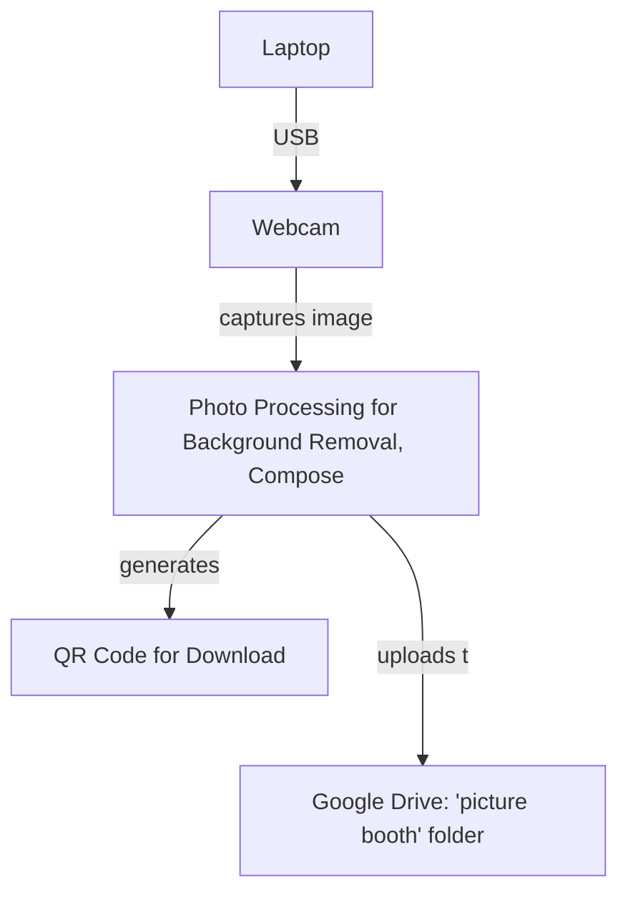

## Project Overview

### Purpose

This project is designed to let users capture and personalize photos in a booth-like experience using only their laptop/webcam with a Python script program. The script enables users to:
- Take photos of themselves (with friends/family) via webcam.
- Replace the original background with an image of their choice, simulating a "green screen" effect without actually needing a physical green screen.
- Download their final images quickly using a generated QR code, or access them anytime through a shared Google Drive folder.

## Features

- **Intuitive Photo Capture**: Launches the webcam and guides users through a countdown timed photo capture, providing a clear, fullscreen interface.
- **Background Replacement (No Green Screen Needed)**: Uses advanced background removal (via `rembg` or OpenCV-based algorithm if rembg not installed), allowing seamless integration of user-chosen digital backgrounds.
- **Background Selection with Instant Preview**: Offers users a gallery of backgrounds to try on their image before finalizing.
- **Automated Cloud Upload**: Final images are automatically uploaded to a specific Google Drive folder for easy access and permanent backup.
- **Download with QR Code**: System generates a QR code linking directly to the Drive file, making sharing as frictionless as possible.
- **Resilient Access**: Even if the QR code is misplaced, users can find their image anytime in the shared “picture booth” folder.
- **Simple Re-setup**: Users can recapture the background reference for background subtraction at any time directly from the interface.

## Workflow

### User Experience Flow

1. **Startup**
   - User launches the app (recommended in Visual Studio Code for easy debugging).
   - App authenticates to Google Drive via Google Cloud API.

2. **Capture Reference Background**
   - On first launch, the app prompts for a reference photo (empty background). This is used for better background subtraction.

3. **Take Photo**
   - User positions themselves, starts the timed countdown, and the webcam snaps a photo.

4. **Select/Preview Background**
   - User browses available digital backgrounds, instantly previewing how the composite will look.

5. **Process & Output**
   - App removes the background from the user's photo, combines it with the selected background, and saves the composite.

6. **Cloud Upload & QR Code**
   - The final composite image is uploaded to Google Drive (“picture booth” folder).
   - A QR code is generated linking to the photo; displayed on-screen for scan-and-download.

7. **Access & Sharing**
   - User scans QR for instant access/downloading.
   - Photos remain accessible via Google Drive for long-lasting availability.

8. **Restart or Take Another**
   - After each session, users can restart to main screen and repeat the process.

## System Diagram

## Technical Highlights

- **Hardware**: Laptop, webcam (built-in or USB).
- **Software Dependencies**:
  - Python 3.x with libraries: OpenCV, Tkinter, Pillow, qrcode, rembg (optional), pydrive.
  - Google Cloud API setup for Drive uploads.
  - Visual Studio Code (suggested for launching/debugging).
- **Background Removal**: Smart algorithm adapts: uses `rembg` if available for best results, else leverages an improved OpenCV pipeline informed by a saved reference image.
- **Cloud Sync**: Robust use of Google Drive via PyDrive, enabling both upload and permissioned sharing.
- **User-Centric UX**: Fullscreen, modern UI with status feedback, visual previews, and touch-friendly controls.

