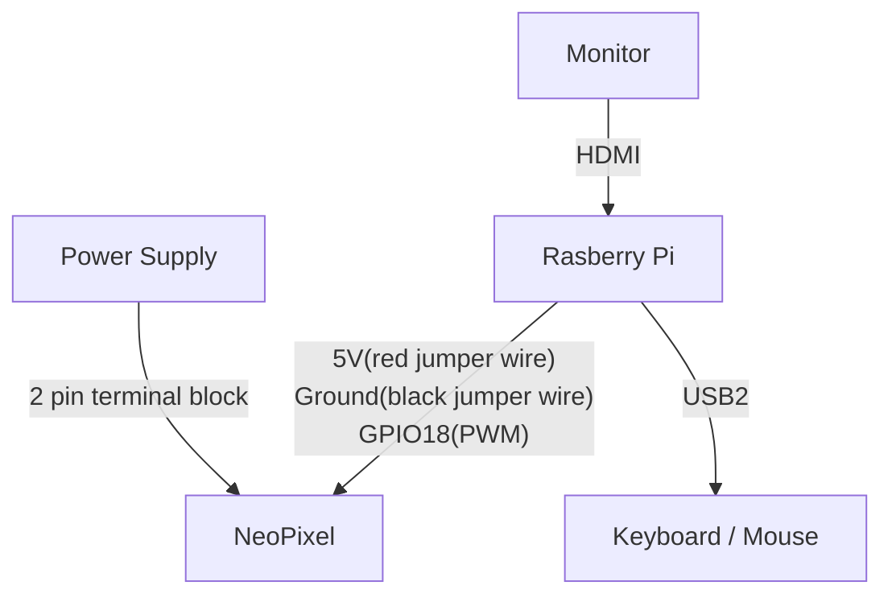
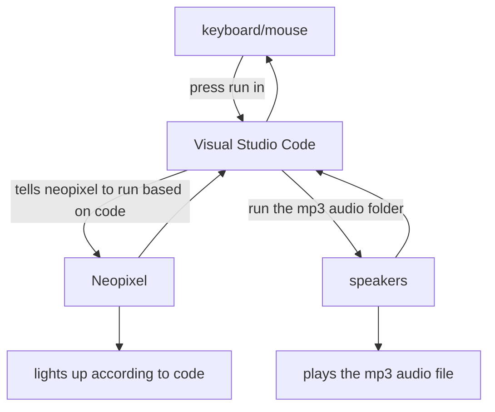

# Introduction
## What is NeoPixel?
NeoPixels are LED pixels that can be individually programmed. They can also be found in many shapes and sizes as well as lengths to suit a consumer's needs

- Circles are offered from a range of 12,16,24, as well as 60 pixels 
- Strips (6 pixels per meter or 30 pixels per meter) for 1 meter + 5 meter lengths can be extended or cut to any required length for soldering 
- Sticks are mostly offered in a group of 8 pixels 
- Individual pixels can be joined together into a single group 
- Matrixes are grids of neopixels sold in 4x8 and 8x8 

link to the product site ```https://www.adafruit.com/category/168```

## Dependencies
### Hardware
- Rasberry Pi 4 Model B
- Adafruit NeoPixel Digital RGB LED Strip - White 30 LED 1m

### Software
- Visual Studio Code
- Raspbian OS (Bullseye version)
-Python packages
- https://github.com/huats-club/rpistarterkit/blob/main/README.md (For Rasberry Pi 4 Model B)
- https://github.com/huats-club/mts_sensor_cookbook/blob/4eb2e9dfefc014b6b86d9134842269ae87d18a5e/3.%20led/led.md (For Neopixel LED control)
### Resources used
- https://github.com/huats-club 
- https://github.com/huats-club/rpistarterkit
- https://github.com/huats-club/mts_sensor_cookbook
- https://www.geeksforgeeks.org/python-gui-tkinter/
- https://diotlabs.daraghbyrne.me/docs/controlling-outputs-neopixels/neopixels/#:~:text=Neopixels%20are%20individually%20addressable%20LED,or%20cut%20to%20desired%20length. (For the introduction)

## System diagram


## Code logic
### How the code is able to light up the NeoPixel

## Code used
```import time
from rpi_ws281x import *

# LED strip configuration:
LED_COUNT = 300 # Number of LED pixels.
LED_PIN = 18           # GPIO pin connected to the pixels (must support PWM!).
LED_FREQ_HZ = 800000   # LED signal frequency in hertz (usually 800khz)
LED_DMA = 10           # DMA channel to use for generating signal (try 10)
LED_BRIGHTNESS = 64  # Set to 0 for darkest and 255 for brightest
LED_INVERT = False     # True to invert the signal (when using NPN transistor level shift)

# Create NeoPixel object with appropriate configuration.
strip = Adafruit_NeoPixel(LED_COUNT, LED_PIN, LED_FREQ_HZ, LED_DMA, LED_INVERT, LED_BRIGHTNESS)
# Intialize the library (must be called once before other functions).
strip.begin()
def colorWipe(strip, color, wait_ms=1):
    """Wipe color across display a pixel at a time."""
    for i in range(strip.numPixels()):
        strip.setPixelColor(i, color)
        strip.show()
        time.sleep(wait_ms/1000.0)

def turnOffLEDs(strip):
    """Turn off all LEDs."""
    for i in range(strip.numPixels()):
        strip.setPixelColor(i, Color(0,0,0))
    strip.show()

def setStaticWhite(strip, brightness=255):
    """Set all LEDs to static white color."""
    color = Color(brightness, brightness, brightness)  # White color
    for i in range(strip.numPixels()):
        strip.setPixelColor(i, color)
    strip.show()
try:
    while True:
        # Color wipe animations.
        colorWipe(strip, Color(255, 0, 0))  # Red wipe
        turnOffLEDs(strip)
        colorWipe(strip, Color(255, 165, 0)) #orange
        turnOffLEDs(strip)
        colorWipe(strip, Color(255, 255, 0)) #yellow
        turnOffLEDs(strip)
        colorWipe(strip, Color(0, 255, 0))  # Green wipe
        turnOffLEDs(strip)
        colorWipe(strip, Color(0, 0, 255))  # Blue wipe
        turnOffLEDs(strip)
        colorWipe(strip, Color(0, 255, 255))
        turnOffLEDs(strip)
        colorWipe(strip, Color(143, 0, 255))
        turnOffLEDs(strip)
        colorWipe(strip, Color(255, 0, 255))
        turnOffLEDs(strip)
        colorWipe(strip, Color(255, 255, 255))
        turnOffLEDs(strip)
except KeyboardInterrupt:
    colorWipe(strip, Color(0,0,0), 10)

```


